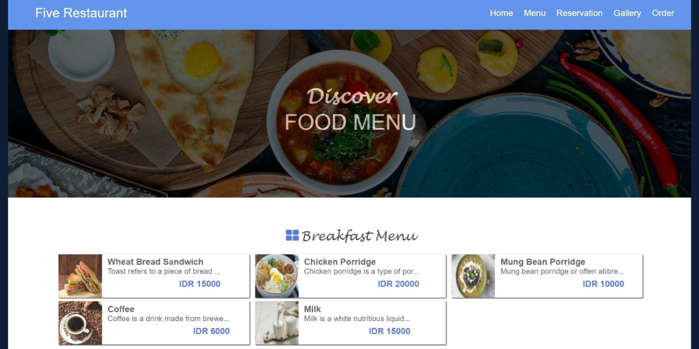

# Web-based Restaurant Management Application System 
This is the final project of the Software Engineering course that we worked on in a group team called 'Group 5'. In this project, we created a Web-based Restaurant Management Application System. 

Before we created our application system, we first made some diagrams such as the use case, activity, class, sequence, software architecture, data design, component level, and deployment level diagrams along with the simple interface design. The aim of creating all the previous diagrams is to make us easier to build our application system and when we build our application system, we have a fixed and more structured process for creating the application system. In our application system, there are two interfaces such as the interface of the customers and the admin, also our application system is already connected with the database, and to create this application system we use PHP, CSS, HTML, JavaScript, and MySQL programming language.

For more detail on what our application system diagrams and the interface designs look like, you may download and read our report that I have already attached within this repository.

